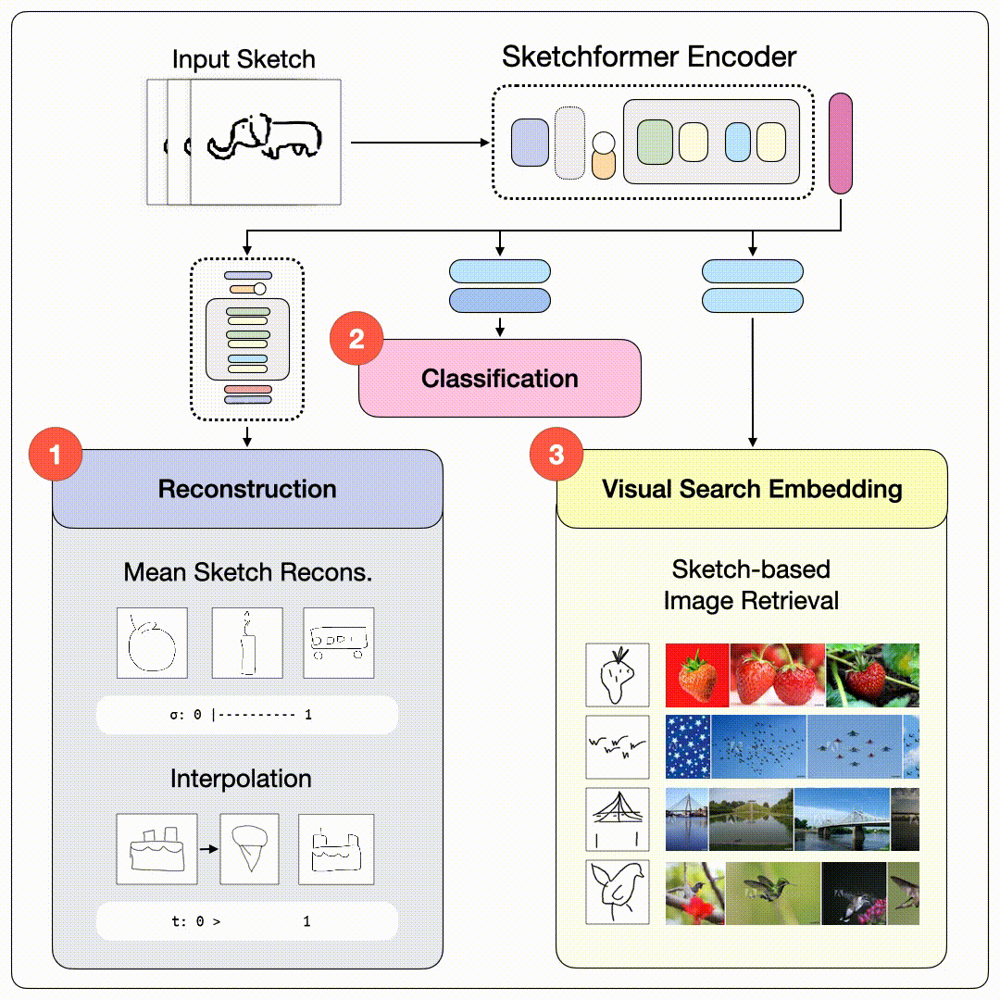

Sketchformer - Official Tensorflow 2.X Implementation
========================================================

  



This repository contains the official TensorFlow 2.X implementation of the following paper:

> Sketchformer: Transformer-based Representation for Sketched Structure

> Leo Sampaio Ferraz Ribeiro (ICMC/USP), Tu Bui (CVSSP/University of Surrey), John Collomosse (CVSSP/University of Surrey and Adobe Research), Moacir Ponti (ICMC/USP)

> University of Surrey

> Abstract: Sketchformer is a novel transformer-based representation for encoding free-hand sketches input in a vector form, i.e. as a sequence of strokes. Sketchformer effectively addresses multiple tasks: sketch classification, sketch based image retrieval (SBIR), and the reconstruction and interpolation of sketches. We report several variants exploring continuous and tokenized input representations, and contrast their performance. Our learned embedding, driven by a dictionary learning tokenization scheme, yields state of the art performance in classification and image retrieval tasks, when compared against baseline representations driven by LSTM sequence to sequence architectures: SketchRNN and derivatives. We show that sketch reconstruction and interpolation are improved significantly by the Sketchformer embedding for complex sketches with longer stroke sequences.

## Preparing the Quickdraw Dataset

We used the [Sketch-RNN QuickDraw Dataset](https://github.com/googlecreativelab/quickdraw-dataset#sketch-rnn-quickdraw-dataset), which can be downloaded as per-class `.npz` files from [Google Cloud](https://console.cloud.google.com/storage/browser/quickdraw_dataset/sketchrnn)

After downloading the files, use our script `prep_data/prepare-distributed-quickdraw` to split the data into multiple files, which is the expected format of our data loader:

In this example we split the dataset into 400 chunks using all 345 classes and remove 100 chunks, which makes our chunked dataset contain class-balanced 75% of the original:
```
 python prep_data/prepare-distributed-quickdraw.py \
    --dataset-dir /path/to/download \
    --n-chunks 400 --n-classes 345 --cut-chunks 100 \
    --target-dir /target/path
```

You should choose your number of chunks by balancing your memory and read speed constraints.

### Preparing dictionary for dict-based tokenizer

If you want to use our dictionary-based sketch tokenizer, the dictionary must be built beforehand. 

```
 python prep_data/sketch_token/create_token_dict.py \
    --dataset-dir /path/to/quickdraw/ \
    --method mini-batch-k-mean
```

## Dependencies

Inside the [dependencies](dependencies) folder you will find two requirements files ([requirements.txt](dependencies/requirements.txt) and [git-requirements.txt](dependencies/git-requirements.txt)) and a [Dockerfile](dependencies/Dockerfile). It is possible to either build the docker image or a virtualenv from the requirements. Python 3.6 is recommended and Tensorflow 2.X obligatory.

## Training

Our training script breaks the params into three categories; (i) base params, common to any model, (ii) model-specific params and (iii) data params. You can see all params available using `--help-hps`:

```
$ python train.py sketch-transformer-tf2 --help-hps


Base model default parameters:
{'autograph': True,
 'batch_size': 128,
 'goal': 'No description',
 'log_every': 100,
 'notify_every': 1000,
 'num_epochs': 10,
 'safety_save': 0.5,
 'save_every': 1.0,
 'slack_config': 'token.secret'}

sketch-transformer-tf2 default parameters:
{'attn_version': 1,
 'blind_decoder_mask': True,
 'class_buffer_layers': 0,
 'class_dropout': 0.1,
 'class_weight': 1.0,
 'd_model': 128,
 'dff': 512,
 'do_classification': True,
 'do_reconstruction': True,
 'dropout_rate': 0.1,
 'is_training': True,
 'lowerdim': 256,
 'lr': 0.01,
 'lr_scheduler': 'WarmupDecay',
 'num_heads': 8,
 'num_layers': 4,
 'optimizer': 'Adam',
 'recon_weight': 1.0,
 'warmup_steps': 10000}

stroke3-distributed data loader default parameters:
{'augment_stroke_prob': 0.1,
 'max_seq_len': 200,
 'random_scale_factor': 0.1,
 'shuffle_stroke': False,
 'token_type': 'dictionary',
 'tokenizer_dict_file': 'prep_data/sketch_token/token_dict.pkl',
 'tokenizer_resolution': 100,
 'use_absolute_strokes': False,
 'use_continuous_data': False}
```

To override default params use a list of comma-separated values, like bellow:

```
python train.py sketch-transformer-tf2 \
    --dataset /path/to/prepared/data \
    -o /path/to/target/output/ \
    --data-hparams use_continuous_data=False \
    --base-hparams num_epochs=50,batch_size=128,save_every=50.,safety_save=50.,log_every=10,notify_every=5000 \
    --hparams d_model=256 \
    --id test --gpu 1 --resume latest
```

During training and evaluation, plots of losses and evaluation metrics are saved every `notify_every` steps. Those plots can be sent to slack as well if the user provides a file with the following format:

```
SLACK-BOT-TOKEN
slack_channel
```

And sets the filename in the `'slack_config'` parameter.

## Evaluation

The `evaluate-metrics.py` script follows most of the same rules as the `train.py` one. By using the same `--id` and `output_dir` (`-o`), the model will automatically read the hparams saved and rebuild the model. You need to specify the `--metrics` as a list of evaluation metrics the model can compute. Metrics are implemented in [metrics](metrics), have a look there if you are unsure which ones to chose.

Example:
```
python evaluate-metrics.py sketch-transformer-tf2 \
    --dataset /path/to/prepared/data \
    -o /path/to/target/output/ --id test \
    --gpu 0 --resume /path/to/checkpoint \
    --metrics "sketch-reconstruction" "val-clas-acc" "tsne" "tsne-predicted"
```

The `--resume` parameter can be either `none`, `latest` or a path. When using `latest`, make sure to use the same `--id` and `output_dir` that were used for training.

## Pretrained Models

Pretrained models for continuous, dict-tokenized and grid-tokenized data schemes are available for download in [Google Drive](https://drive.google.com/drive/folders/1sTAKRDkVeKY2ACLvseKNHUr6QonLBXHc?usp=sharing)

## Citation

```
@inproceedings{Sketchformer2020,
 title = {Sketchformer: Transformer-based Representation for Sketched Structure},
 author = {Leo Sampaio Ferraz Ribeiro and Tu Bui and John Collomosse and Moacir Ponti},
 booktitle = {Proc. CVPR},
 year = {2020},
} 
```
